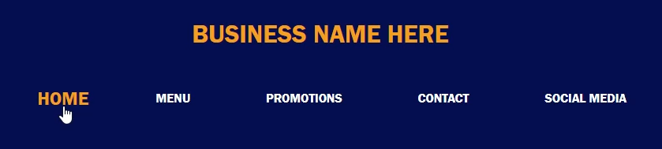

# Example of simple responsive button styling

 Navigation bars are often used in a variety of different web pages. To make websites stand out against others, it's essential to incorporate animations and responsive aspects. This simple stylesheet and HTML markdown show how easy it can be to make this happen.  

## Demo: 
Hover State
  

Active State (when button is clicked)
  

Return State

## In this specific example, it includes the following features:  
##   - A hover state on each list item that grows the text  
##   - An active state (when item is clicked) that cause the button to shrink quickly. Additionally, the font color changes back to white and an underline is added to signify that the button has been clicked  
##   - After clicking, the item returns to it's initial state  

