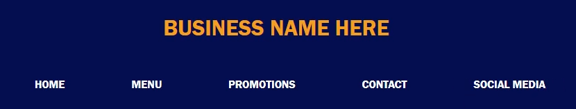
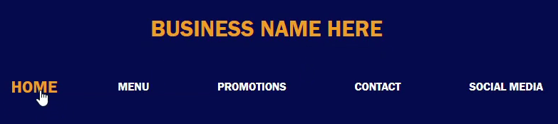
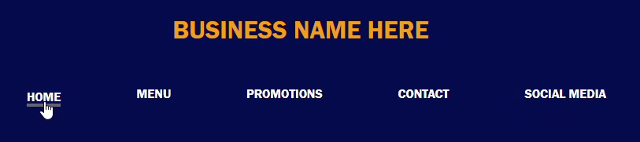

# Example of simple responsive button styling

 Navigation bars are often used in a variety of different web pages. To make websites stand out against others, it's essential to incorporate animations and responsive aspects. This simple stylesheet and HTML markdown show how easy it can be to make this happen.  

## Demo: 

Initial State

Hover State
  

Active State (when button is clicked)
  

Return State (after letting go of click)
  

Final State (moving cursor off)

## In this specific example, it includes the following features:  
    - A hover state on each list item that grows the text  
    - An active state (when item is clicked) that cause the button to shrink quickly. Additionally, the font color changes back to white and an underline is added to signify that the button has been clicked  
    - After clicking, the item returns to it's initial state  

## Setup Instructions
This code can be customized to choose the most suitable color and action for your project. Whether it is the background-color, font-color, font-size, or the speed of the buttons action, it can all be achieved by making some small tweaks within the styles.css file.

## Author
Vita Tran - (https://github.com/vita-tran)